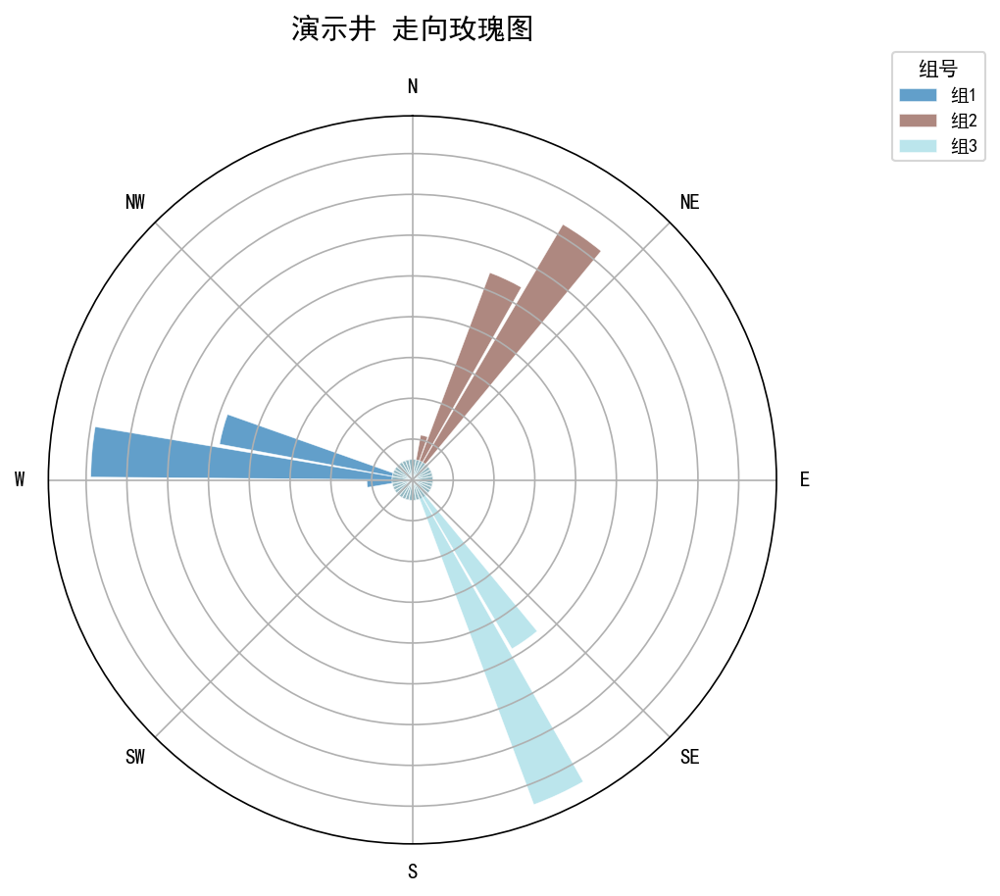
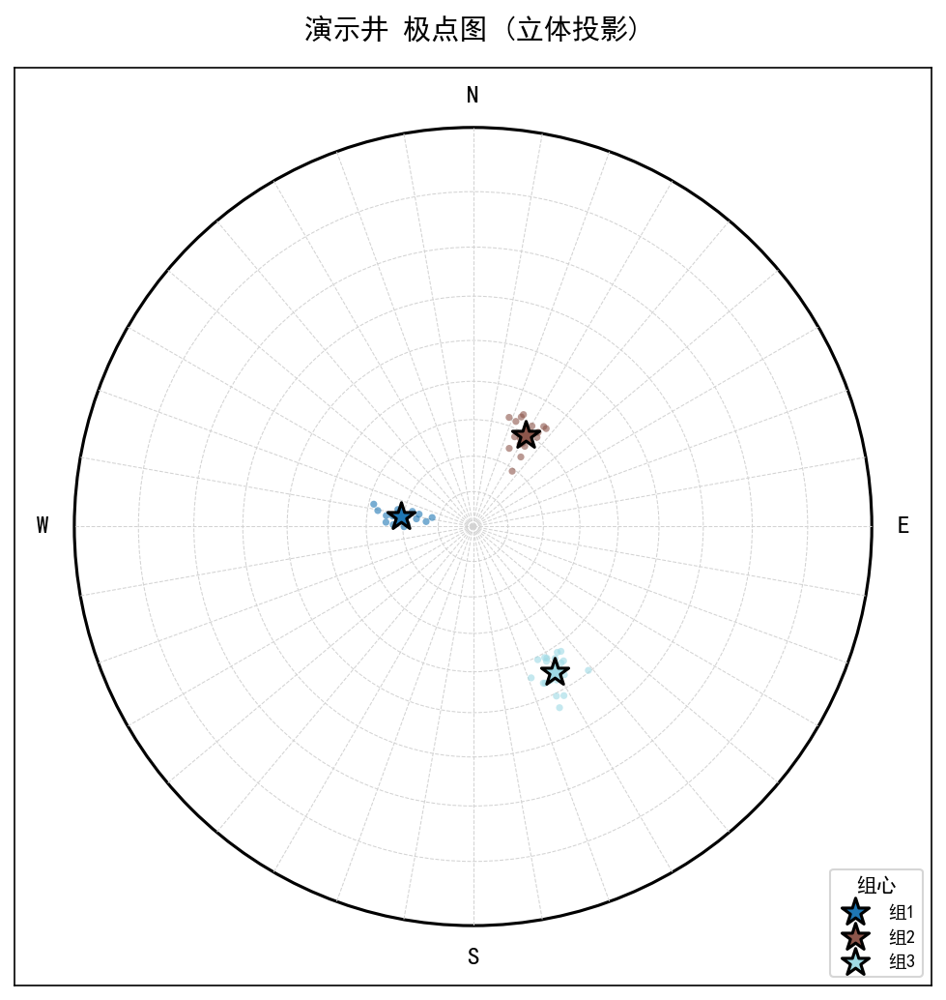
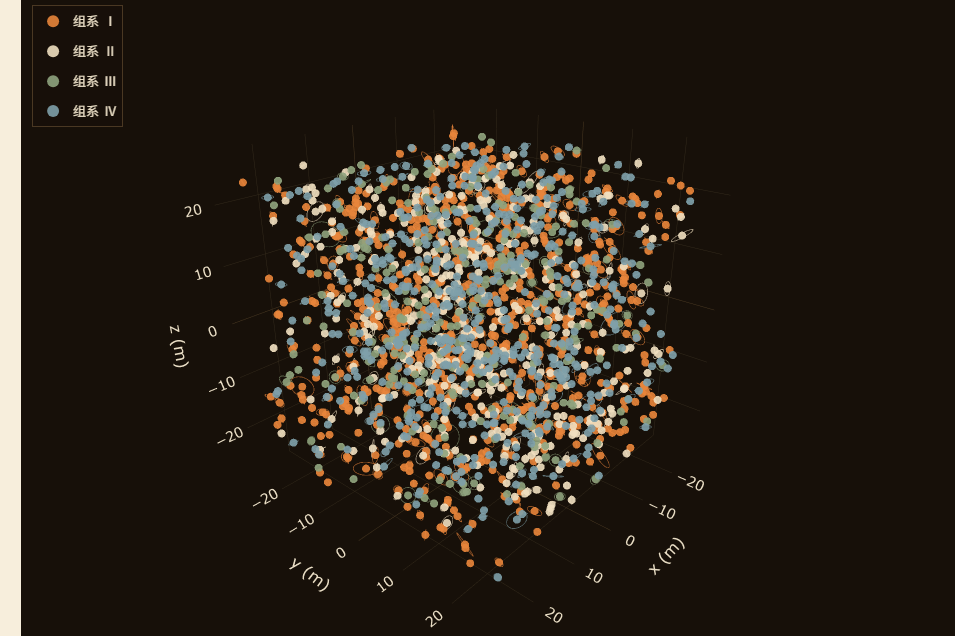

# FractureFlow

**English** | [中文](README_zh.md)

> **Borehole logs in, structural-orientation reports out.** FractureFlow turns
> raw fracture observations into the structural chapter of a geotechnical
> investigation report — automatically, and without fracture-level labels.

Structural-orientation statistics (joint-set tables, rose diagrams, spacing
and connectivity screening) are a mandatory chapter in geotechnical
investigation reports — and are still produced almost entirely by hand,
typically days of work per site. FractureFlow replaces that workflow:

```
borehole log (depth, dip, dip-direction)
   -> auto-labeled fracture sets (no labels needed)
   -> set table + rose diagram + stereonet
   -> DFN realization + percolation screening
   -> written report
```

Every accuracy claim below is backed by a leak-audited evaluation protocol,
and the results that did *not* work are published too — see
[Honesty & negative results](#honesty--negative-results).

---

## See it first (demo outputs, synthetic data)

These figures were produced by the one-click demo on a synthetic 3-set
borehole log — no real site data. Full sample deliverables:
[`examples/`](examples/). An interactive showcase (including a rotatable 3D
DFN) is served on
[GitHub Pages](https://wansong42.github.io/fractureflow/).

| Rose diagram | Stereonet (pole plot) | DFN + percolation screening |
|---|---|---|
|  |  |  |

## Quick start (2 minutes)

```bash
git clone https://github.com/wansong42/fractureflow.git
cd fractureflow

# Python >= 3.10; CPU is sufficient
pip install .              # installs fractureflow + dependencies
#   or: pip install -r requirements.txt
#   or: conda env create -f environment.yml && conda activate fractureflow

./run_demo.sh            # Windows: run_demo.cmd
```

The demo generates a synthetic borehole log and runs the full chain:
auto-labeling, set-table CSV, rose and polar diagrams, a DFN realization,
percolation screening (`p_conn(P32)` curve + scenario indicators), and a
Markdown report. No external data required.

Check the outputs any time in `results/demo/` — or browse the committed
snapshots in [`examples/`](examples/) first.

## Use your own data

```bash
# Borehole record as CSV (depth / dip / dip-direction columns,
# common name variants are auto-recognized)
python scripts/auto_label_borehole.py --csv your_log.csv --out labeled.pt

# Excel borehole record -> report one-pager
python scripts/borehole_excel_entry.py --help

# FMI-style LAS file, end-to-end:
# labeling -> set table -> DFN -> percolation -> report
python scripts/full_pipeline.py --input-las your_well.las --domain 50 50 50

# Multi-well site model (per-well labeling + consistency audit + 4 views)
python -m fractureflow.eval --site-model --wells your_wells.npz \
    --site-domain 50 50 50 --site-out-dir results/site_model/
```

## Algorithms included

Everything below is in `src/fractureflow/` under the MIT license —
inspectable, importable, and covered by the test suite.

| What it does | Where |
|---|---|
| **Route-A auto-labeling** — spherical k-means on undirected fracture normals (`|cos|` assignment + sign alignment), with adaptive-K selection | `setlabel.py`, `adaptive_k.py` |
| **Fréchet-median orientation predictor** (`l1_local`) — predicts hidden fracture orientations from local observed geometry; the strongest label-free point predictor | `inference.py` |
| **Terzaghi sampling correction** — 1/|n·a| weighting for orientation bias of borehole intersections | `terzaghi.py` |
| **Baecher-disk DFN generator** — discs from set table + P32 intensity + power-law sizes (β from trace-length MLE, Clauset-style) | `dfn.py` |
| **Percolation screening** — Balberg excluded-volume threshold, `p_conn(P32)` curves, EGS / mining / disposal scenario indicators | `percolation.py` |
| **Multi-well joint decision rule** — pool vs. keep-independent from set-centroid agreement between wells | `site_model.py` |
| **Conflict-gated multi-source fusion** — L0 logs + L1 imaging + outcrop evidence, merged only where sources agree | `l4/` |
| **Dense point-cloud normals without labels** — RANSAC plane segmentation + local SVD (built for 3D scan data) | `segmentation.py` |
| **BlindInput honest-evaluation harness** — hidden-point protocol, poison pills, leak red-flag audit | `honest_eval.py`, `set_table_eval.py` |
| **Equivariant neural backbones** — the research line, released as a documented negative result (see honesty section) | `backbones/` |

Typical programmatic use — load orientations, label, evaluate:

```bash
# set table + report straight from a CSV borehole record
python scripts/auto_label_borehole.py --csv your_log.csv --plot

# honest leaderboard evaluation on the shipped benchmark cohort
python -m fractureflow.eval --point-mode l1local
```

## Benchmarks: how far label-free inference reaches

Capability is organized by observation tier (L0 → L4). Values are frozen
anchors from the shipped result files (path given per row); the evaluation
protocol is leak-audited (footnote below the table).

| Tier | Data | Metric (honest protocol*) | Value | Evidence |
|---|---|---|---|---|
| L0 | borehole logs (22 wells, 880 fractures) | hidden-point MAE | **36.69°** | [`results/honest_leaderboard/l1_local__beishan_22.json`](results/honest_leaderboard/l1_local__beishan_22.json) |
| L0 | same | set-table modal error (K=12, obs-only k-means) | **9.82° ± 0.66°** | [`results/global_honest_leaderboard/beishan.json`](results/global_honest_leaderboard/beishan.json) |
| L1 | borehole imaging (FORGE, 2 wells, 4328 fractures) | hidden-point MAE | **39.70° ± 0.33°** | [`results/global_honest_leaderboard/forge.json`](results/global_honest_leaderboard/forge.json) |
| L1 | borehole imaging (FORGE) | set-table modal error | **12.37° ± 4.00°** | [`results/global_honest_leaderboard/forge.json`](results/global_honest_leaderboard/forge.json) |
| L1 | DFN benchmark (DECOVALEX, 1089 fractures) | set-table modal error (K=4) | **0.05°** | [`results/global_honest_leaderboard/decovalex.json`](results/global_honest_leaderboard/decovalex.json) |
| L1 | same, with `fracture_id` (Route B) | hidden-point MAE | **0.0054°** | [`results/decovalex_routeB.json`](results/decovalex_routeB.json) |
| L3 | dense point cloud (synthetic 4-wall benchmark) | hidden-point MAE | **0.37°** | [`results/pointcloud_gate.json`](results/pointcloud_gate.json) |

\* *Honest protocol* = BlindInput evaluation: hidden points are never visible
to the predictor, masks are fixed (`obs_frac=0.4`, `rng=999`), and the metric
is `mean acos(|<pred, true>|)` over hidden points, 10 seeds. A
poison-pill/self-leak audit runs inside the harness.

Caliber note: the FORGE set-table figure quotes the linked result file as
shipped (pooled obs-only k-means, 10 seeds). The project's type-aware rebuild
pipeline reports **11.05° ± 2.14°** on the same data — both are honest
post-bug-fix calibers; they differ in grouping protocol, not in correctness.

**The practical reading of this table**: point-level reconstruction from
unlabeled borehole data tops out around ~37–49° — an information limit, not
a model limit. But the *set-table* regime (≥5 observations per group,
K=4–12) reaches **7–12° modal error**, inside the ≤12° engineering
threshold. That is what the product chain above delivers, and that is the
regime geotechnical reports actually use.

## Honesty & negative results

This project measured its own ceiling and publishes it — we believe bounded
claims with failure modes are worth more to practitioners than unbounded
claims without evidence. Highlights:

- **An early headline claim was a leak.** Under the leak-audited BlindInput
  protocol the same method scores **36.69°**, not the 13° originally
  reported. The correction history is preserved, not erased (see
  `CHANGELOG.md`).
- **The unlabeled information ceiling is ~31.7° ± 0.5°** (point-level):
  two fracture traces closer than a quarter radius can have normals
  differing by ~30°, so without structure signals (`fracture_id`, trace
  connectivity) no model can recover the assignment.
- **Neural networks do not beat the geometric baseline.** Equivariant
  message-passing models score *worse* than the geometric `l1_local`
  predictor and stay capped by the same ceiling — released as a documented
  negative result.
- **Multi-orientation dense point clouds: BLOCKED-BY-DATA.** A 2026-08
  survey found no public dataset that is real + multi-orientation + 3D +
  downloadable + ground-truthed. The L3 claim rests on a synthetic
  4-wall benchmark (MAE 0.37°, misclassification 0.4%) and is not
  generalized beyond wall-level separation.
- **Deprecated numbers are marked, not silently replaced.** Where a bug fix
  changed a published number (e.g. a sin/cos transpose in the FORGE
  pipeline), old and new values are traceable in the audit trail and result
  files carry `post-fix` provenance notes.

## Repository layout

```
src/fractureflow/      core library (algorithms listed above)
scripts/               product chain + demo + geometry-convention guard
examples/              committed demo outputs (report, set table, figures)
tests/                 unit + regression suite (CI: pytest on 3.10/3.11)
results/               frozen result snapshots backing the benchmark table
data/                  redistributable derived data (see data policy)
docs/                  GitHub Pages portal source (interactive DFN demo)
```

All code and documentation are plain-text Python / Markdown. The only
binary files in the repository are data fixtures (`data/**/*.pt`, derived
from openly licensed FORGE logs) and figures (`*.png`) — no code is shipped
as binary.

## Data policy

Per the compliance audit (2026-08-29), third-party data falls into three
rulings (full table in [`THIRD_PARTY_NOTICES.md`](THIRD_PARTY_NOTICES.md)):

- **Included** — project-derived files from openly licensed sources (Utah
  FORGE, CC BY 4.0; attribution in `THIRD_PARTY_NOTICES.md`) and
  project-synthetic fixtures (`data/real/r60_wells_csv/`).
- **Link-only** — DECOVALEX, raw FORGE logs, Pontrelli, GeoCrack, INEL-1,
  EGS Collab, OpenTopography point clouds. Download from the official
  sources cited in the notices file.
- **Excluded** — the Beishan pre-selection area data (and mixed files
  containing it) is **not redistributable** and is excluded from this
  repository.

The repository is **data-self-sufficient**: the demo and the test suite run
entirely on synthetic or included data.

## Testing

```bash
python -m pytest tests -q
```

CI runs the suite plus a geometry-convention grep gate on Python 3.10/3.11.
The suite covers geometry conventions (dip↔normal round-trips, Terzaghi
weights, sign alignment), data-leak guards, DFN/percolation invariants,
report generation, the multi-well joint decision rule, and the release
guards themselves. Regression tests that need link-only real data are
skipped with a recorded reason when that data is absent — see
`RELEASE_VERIFICATION.md` for the per-test registry.

## Citation

See [`CITATION.cff`](CITATION.cff). If this repository is used in academic
work, please cite the software and the underlying datasets (notices file §3).

## License

MIT — see [`LICENSE`](LICENSE). Third-party components and data rulings:
[`THIRD_PARTY_NOTICES.md`](THIRD_PARTY_NOTICES.md).

## Acknowledgments

This work was carried out at the China University of Mining and Technology
(Beijing) under the Undergraduate Innovation and Entrepreneurship Training
Program (大学生创新创业训练计划), with guidance from the project supervisor
Prof. Liu Peng (刘鹏).

Author: Jiacheng Yi (易嘉诚), 2998812494@qq.com.
