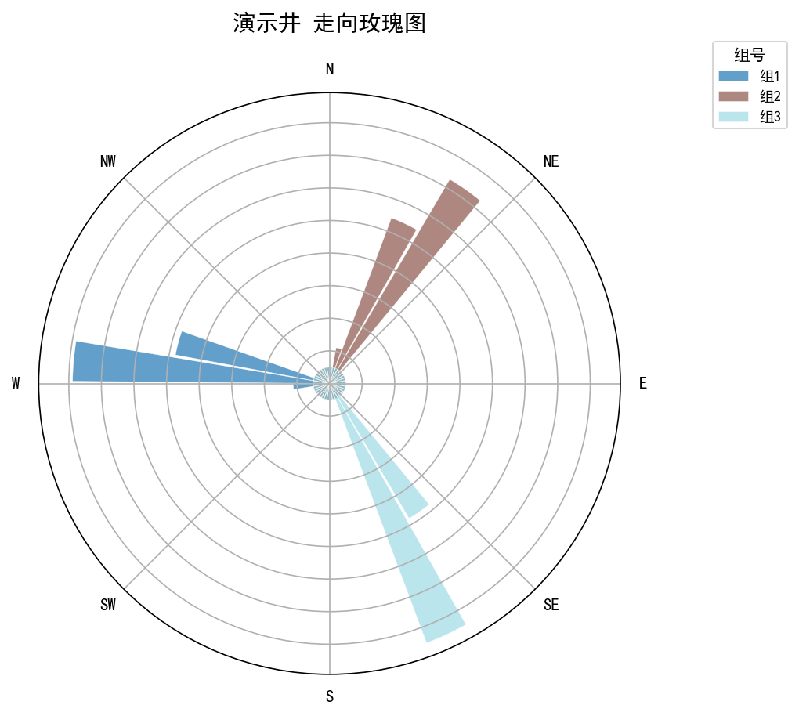
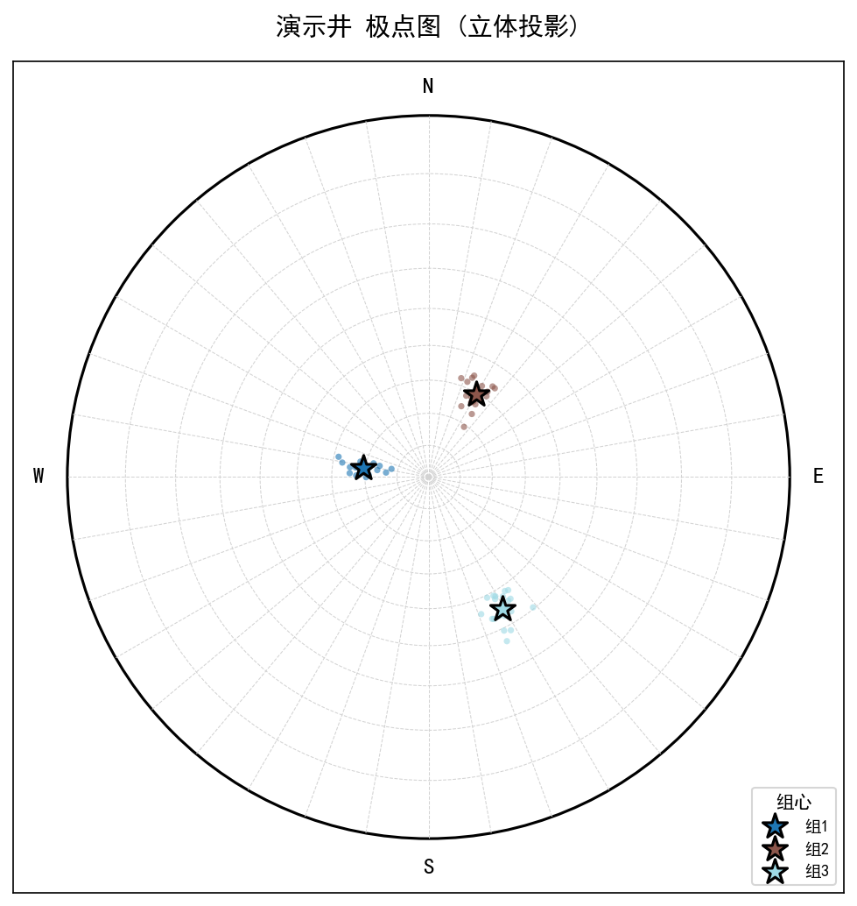
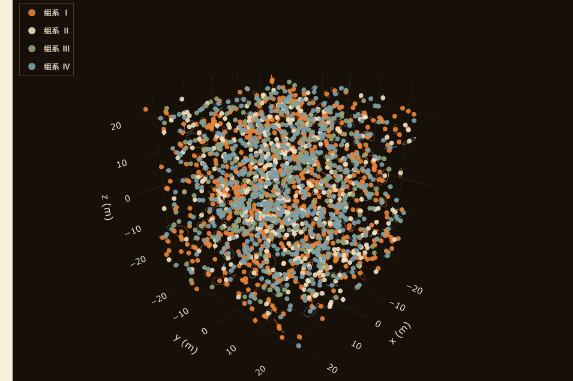

# FractureFlow

**English** | [中文](README_zh.md)

> **Borehole logs in, structural-orientation reports out.** FractureFlow turns
> raw fracture observations into the structural chapter of a geotechnical
> investigation report — automatically, and without fracture-level labels.

Structural-orientation statistics (joint-set tables, rose diagrams, spacing
and connectivity screening) are a mandatory chapter in geotechnical
investigation reports — and are still produced almost entirely by hand,
typically days of work per site. FractureFlow replaces that workflow:

```
borehole log (depth, dip, dip-direction)
   -> auto-labeled fracture sets (no labels needed)
   -> set table + rose diagram + stereonet
   -> DFN realization + percolation screening
   -> written report
```

Every accuracy claim below is backed by a leak-audited evaluation protocol,
and the results that did *not* work are published too — see
[Honesty & negative results](#honesty--negative-results).

---

## See it first (demo outputs, synthetic data)

These figures were produced by the one-click demo on a synthetic 3-set
borehole log — no real site data. Full sample deliverables:
[`examples/`](examples/). An interactive showcase (including a rotatable 3D
DFN) is served on
[GitHub Pages](https://wansong42.github.io/fractureflow/).

| Rose diagram | Stereonet (pole plot) | DFN + percolation screening |
|---|---|---|
|  |  |  |

## Quick start (2 minutes)

```bash
git clone https://github.com/wansong42/fractureflow.git
cd fractureflow

# Python >= 3.10; CPU is sufficient
pip install .              # installs fractureflow + dependencies
#   or: pip install -r requirements.txt
#   or: conda env create -f environment.yml && conda activate fractureflow

./run_demo.sh            # Windows: run_demo.cmd
```

The demo generates a synthetic borehole log and runs the full chain:
auto-labeling, set-table CSV, rose and polar diagrams, a DFN realization,
percolation screening (`p_conn(P32)` curve + scenario indicators), and a
Markdown report. No external data required.

Check the outputs any time in `results/demo/` — or browse the committed
snapshots in [`examples/`](examples/) first.

## Use your own data

```bash
# Borehole record as CSV (depth / dip / dip-direction columns,
# common name variants are auto-recognized)
python scripts/auto_label_borehole.py --csv your_log.csv --out labeled.pt

# Excel borehole record -> report one-pager
python scripts/borehole_excel_entry.py --help

# FMI-style LAS file, end-to-end:
# labeling -> set table -> DFN -> percolation -> report
python scripts/full_pipeline.py --input-las your_well.las --domain 50 50 50

# Multi-well site model (per-well labeling + consistency audit + 4 views)
python -m fractureflow.eval --site-model --wells your_wells.npz \
    --site-domain 50 50 50 --site-out-dir results/site_model/
```

## Algorithms included

Everything below is in `src/fractureflow/` under the MIT license —
inspectable, importable, and covered by the test suite.

| What it does | Where |
|---|---|
| **Route-A auto-labeling** — spherical k-means on undirected fracture normals (`|cos|` assignment + sign alignment), with adaptive-K selection | `setlabel.py`, `adaptive_k.py` |
| **Fréchet-median orientation predictor** (`l1_local`) — predicts hidden fracture orientations from local observed geometry; the strongest label-free point predictor | `inference.py` |
| **Terzaghi sampling correction** — 1/|n·a| weighting for orientation bias of borehole intersections | `terzaghi.py` |
| **Baecher-disk DFN generator** — discs from set table + P32 intensity + power-law sizes (β from trace-length MLE, Clauset-style) | `dfn.py` |
| **Percolation screening** — Balberg excluded-volume threshold, `p_conn(P32)` curves, EGS / mining / disposal scenario indicators | `percolation.py` |
| **Multi-well joint decision rule** — pool vs. keep-independent from set-centroid agreement between wells | `site_model.py` |
| **Conflict-gated multi-source fusion** — L0 logs + L1 imaging + outcrop evidence, merged only where sources agree | `l4/` |
| **Dense point-cloud normals without labels** — RANSAC plane segmentation + local SVD (built for 3D scan data) | `segmentation.py` |
| **BlindInput honest-evaluation harness** — hidden-point protocol, poison pills, leak red-flag audit | `honest_eval.py`, `set_table_eval.py` |
| **Equivariant neural backbones** — the research line, released as a documented negative result (see honesty section) | `backbones/` |

Typical programmatic use — load orientations, label, evaluate:

```bash
# set table + report straight from a CSV borehole record
python scripts/auto_label_borehole.py --csv your_log.csv --plot

# honest leaderboard evaluation on the shipped benchmark cohort
python -m fractureflow.eval --point-mode l1local
```

## Benchmarks: how far label-free inference reaches

Capability is organized by observation tier (L0 → L4). Values are frozen
anchors from the shipped result files (path given per row); the evaluation
protocol is leak-audited (footnote below the table).

This table reports **point-level** error only: the angle between a predicted
hidden-fracture normal and its recorded normal. Group-level ("set-table")
error is a different estimand, and on a site without an independent joint-set
classification it can only be scored against that site's own clustering — so
those readings are kept out of this table and reported below, per row, as
consistency rather than accuracy
(see "Set-table readings: consistency, not accuracy").

| Tier | Data | Metric (honest protocol*, point-level) | Value | Evidence |
|---|---|---|---|---|
| L0 | borehole logs (22 wells, 880 fractures) | hidden-point MAE | **36.69°** | [`results/honest_leaderboard/l1_local__beishan_22.json`](results/honest_leaderboard/l1_local__beishan_22.json) |
| L1 | borehole imaging (FORGE, 2 wells, 4328 fractures) | hidden-point MAE | **39.70° ± 0.33°** | [`results/global_honest_leaderboard/forge.json`](results/global_honest_leaderboard/forge.json) |
| L1 | DFN benchmark (DECOVALEX, 1089 fractures), with `fracture_id` (Route B) | hidden-point MAE | **0.0054°** | [`results/decovalex_routeB.json`](results/decovalex_routeB.json) |
| L3 | dense point cloud (synthetic 4-wall benchmark) | hidden-point MAE | **0.37°** | [`results/pointcloud_gate.json`](results/pointcloud_gate.json) |

\* *Honest protocol* = BlindInput evaluation: hidden points are never visible
to the predictor, masks are fixed (`obs_frac=0.4`, `rng=999`), and the metric
is `mean acos(|<pred, true>|)` over hidden points, 10 seeds. A
poison-pill/self-leak audit runs inside the harness.

### Set-table readings: consistency, not accuracy (appendix position, not a commitment line)

The product-relevant group-level statistic is the **modal direction error** of
the generated set table (`set_table_score`: Hungarian pairing against a
reference table, K fixed, 10 mask seeds). What the reference table *is* decides
what the reading may say:

- **TRUTH** — the reference existed before the observation (a generator's own
  family labels). Only such a reading may be called *accuracy*.
- **CIRCULAR** — the site has no independent joint-set classification, so the
  reference can only be a k-means table built from that same site's own normals
  with the same estimator. Such a reading measures **how well the pipeline
  reproduces its own clustering**; it is not accuracy, and it must name its
  loop object.

| Site | Reading | Value | Evidence level and loop object | Evidence |
|---|---|---|---|---|
| DECOVALEX (DFN benchmark) | set-table modal error, K=4 | **0.05°** | **consistency (CIRCULAR)** — reference is the same cohort's observed-fracture k-means table, i.e. the same data and the same estimator as the prediction (the shipped file's own provenance string: `obs-only k-means, 10 seeds, pooled`). The site does carry generator family labels; the truth-referenced re-measurement of them is a different reading, held with the project's set-table admission records, and is deliberately not printed here. | [`results/global_honest_leaderboard/decovalex.json`](results/global_honest_leaderboard/decovalex.json) |
| beishan (22 wells) | set-table modal error, K=12 | **9.82° ± 0.66°** | **consistency (CIRCULAR)** — reference is this site's own k-means table over its recorded normals (same estimator as the labeling step). K is beyond the cap this statistic supports (K must stay at or below half the per-well observation count), and at large K it degenerates toward the nearest-observed-normal value — hence the appendix position. Do not compare it across K, and not against the point-level rows above either. | [`results/global_honest_leaderboard/beishan.json`](results/global_honest_leaderboard/beishan.json) |
| FORGE (2 wells) | set-table modal error, K=12 | **12.37° ± 4.00°** | **consistency (CIRCULAR)** — reference is this site's own full-normal k-means table over both wells' recorded normals, built with the same estimator as the labeling step, on the post sin/cos-fix normals. Same caution as the previous row regarding K. **Digit collision:** these digits are also used elsewhere in this project for a point-level error floor that needs oracle-level assignment (not deployable) and for a mixed-pooling grouping protocol. Neither is this row, and this row is not a bound, a floor, or an achievable-accuracy figure. | [`results/global_honest_leaderboard/forge.json`](results/global_honest_leaderboard/forge.json) |

Caliber note: the FORGE row above quotes the linked result file as shipped
(pooled obs-only k-means, 10 seeds). The project's type-aware rebuild pipeline
reports **11.05° ± 2.14°** on the same data — both are honest post-bug-fix
calibers of the *same consistency quantity*; they differ in grouping protocol,
not in correctness, and neither one is an accuracy measurement.

**What these readings do — and do not — support.** Point-level: every method
tried on unlabeled borehole logs, including the equivariant networks, stays
inside the ~37–49° band — an information limit rather than a model limit (the
upper figure of that band is the no-`fracture_id` point evaluation in the
DECOVALEX file linked in the table above, a DFN benchmark rather than borehole
data). Group-level: the labeling pipeline reproduces each site's own group
structure to within the consistency figures quoted above — consistency
against that site's own k-means table, built with the same estimator, not
accuracy — and the report generator emits exactly that structure. None of these rows is an accuracy
measurement on a real site, so none is offered as a delivered capability. The
≤12° engineering acceptance threshold on group-modal-direction error is a
criterion to be met by a *site-specific evaluation against an independent
reference*: the threshold is an operative acceptance criterion, the error
readings under it are not, and no reading on this page is presented as
satisfying it. A verified number requires the site to supply an independent
joint-set classification, or fracture-level `fracture_id` traces — with those
the same pipeline reaches the Route-B row above.

## Honesty & negative results

This project measured its own ceiling and publishes it — we believe bounded
claims with failure modes are worth more to practitioners than unbounded
claims without evidence. Standing rule: the accuracy wording that is operative
is the one in the **currently published version only**; any numeric commitment
found in git history, superseded tags or a cached page copy is void (added in
`0.1.2`; history is deliberately not rewritten). Highlights:

- **An early headline claim was a leak.** Under the leak-audited BlindInput
  protocol the same method scores **36.69°**, not the 13° originally
  reported. The correction history is preserved, not erased (see
  `CHANGELOG.md`).
- **The unlabeled information ceiling is ~31.7° ± 0.5°** (point-level):
  two fracture traces closer than a quarter radius can have normals
  differing by ~30°, so without structure signals (`fracture_id`, trace
  connectivity) no model can recover the assignment.
- **Neural networks do not beat the geometric baseline.** Equivariant
  message-passing models score *worse* than the geometric `l1_local`
  predictor and stay capped by the same ceiling — released as a documented
  negative result.
- **Multi-orientation dense point clouds: BLOCKED-BY-DATA.** A 2026-08
  survey found no public dataset that is real + multi-orientation + 3D +
  downloadable + ground-truthed. The L3 claim rests on a synthetic
  4-wall benchmark (MAE 0.37°, misclassification 0.4%) and is not
  generalized beyond wall-level separation.
- **Deprecated numbers are marked, not silently replaced.** Where a bug fix
  changed a published number (e.g. a sin/cos transpose in the FORGE
  pipeline), old and new values are traceable in the audit trail and result
  files carry `post-fix` provenance notes.

## Repository layout

```
src/fractureflow/      core library (algorithms listed above)
scripts/               product chain + demo + geometry-convention guard
examples/              committed demo outputs (report, set table, figures)
tests/                 unit + regression suite (CI: pytest on 3.10/3.11)
results/               frozen result snapshots backing the benchmark table
data/                  redistributable derived data (see data policy)
docs/                  GitHub Pages portal source (interactive DFN demo)
```

All code and documentation are plain-text Python / Markdown. The only
binary files in the repository are data fixtures (`data/**/*.pt`, derived
from openly licensed FORGE logs) and figures (`*.png`) — no code is shipped
as binary.

## Data policy

Per the compliance audit (2026-08-29), third-party data falls into three
rulings (full table in [`THIRD_PARTY_NOTICES.md`](THIRD_PARTY_NOTICES.md)):

- **Included** — project-derived files from openly licensed sources (Utah
  FORGE, CC BY 4.0; attribution in `THIRD_PARTY_NOTICES.md`) and
  project-synthetic fixtures (`data/real/r60_wells_csv/`).
- **Link-only** — DECOVALEX, raw FORGE logs, Pontrelli, GeoCrack, INEL-1,
  EGS Collab, OpenTopography point clouds. Download from the official
  sources cited in the notices file.
- **Excluded** — the Beishan pre-selection area data (and mixed files
  containing it) is **not redistributable** and is excluded from this
  repository.

The repository is **data-self-sufficient**: the demo and the test suite run
entirely on synthetic or included data.

## Testing

```bash
python -m pytest tests -q
```

CI runs the suite plus a geometry-convention grep gate on Python 3.10/3.11.
The suite covers geometry conventions (dip↔normal round-trips, Terzaghi
weights, sign alignment), data-leak guards, DFN/percolation invariants,
report generation, the multi-well joint decision rule, and the release
guards themselves. Regression tests that need link-only real data are
skipped with a recorded reason when that data is absent — see
`RELEASE_VERIFICATION.md` for the per-test registry.

## Citation

See [`CITATION.cff`](CITATION.cff). If this repository is used in academic
work, please cite the software and the underlying datasets (notices file §3).

## License

MIT — see [`LICENSE`](LICENSE). Third-party components and data rulings:
[`THIRD_PARTY_NOTICES.md`](THIRD_PARTY_NOTICES.md).

## Acknowledgments

This work was carried out at the China University of Mining and Technology
(Beijing) under the Undergraduate Innovation and Entrepreneurship Training
Program (大学生创新创业训练计划), with guidance from the project supervisor
Prof. Liu Peng (刘鹏).

Author: Jiacheng Yi (易嘉诚), 2998812494@qq.com.
